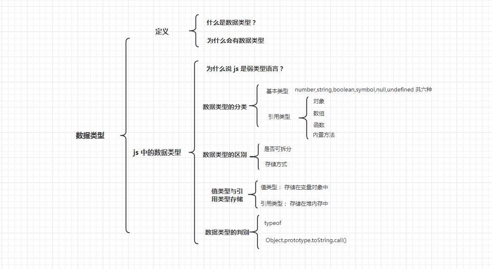

# 数据类型





## 定义

### 什么是数据类型？

**数据类型，就是将数据按照某一规则进行区别时所定义的分类标签。比如说，同样都是汉字组成的词语，要分动词、名词、介词等。**

### 为什么会有数据类型？它出现的意义是什么？

对数据分类，主要有两个原因：

第一，**为了限制不同种类数据的操作**。比如说当你声明一个变量是一个数字，那么，就只能对这个变量进行数字能进行的操作，这在编译代码及排查错误时尤为重要。

第二，由于所有的数据都要存储在计算机中，不同类型数据的存储位置及所需要的内存大小也不一样，而对数据分类后，编程时需要用大数据的时候才需要申请大内存，这样可以充分利用内存。 

例如大胖子必须睡双人床，就给他双人床，瘦的人单人床就够了。

## JavaScript 中的数据类型
### 为什么称 JavaScript 为弱类型语言？

JavaScript 中变量是没有类型的，只有值才有。变量可以随时持有任何类型的值。

举个例子：
``` js
// js
let a = 4;
a = '4';
a = false;
```
在上面的例子中，我们声明 `a` 是一个数字，但是我们在之后将 `a`  的值又改成了字符串和布尔值（后面会讲这些类型）。可以看到，变量 `a` 的类型是可以随意转变的，这在强类型语言里是不允许的。

因此，判断一门语言是强类型还是弱类型，就看这门语言中**一个变量是否可以赋不同数据类型的值。**

### JavaScript 有哪些数据类型？

在 JavaScript 中，共有七种数据类型，其中，六种是基本/原始类型，一种是对象/复合/引用类型。

#### 基本类型:

- 字符串(String)：表示一个字符串，如“find”。
- 数字(Number)：表示一个数字，如 45 。
- 布尔(Boolean)：布尔值，包括 false 和 true 。 
- 未定义（undefined）：只有一个值，undefined , 表示未给变量赋值。 
- 空值（null）：只有一个值， null , 表示空值得关键字。
- Symbol(es6新增)：表示一个唯一且不可改变的值。

#### 引用类型：
- 对象(object): 各种值组成的集合。

其中，对象类型还有一些子类型，如数组，函数，JavaScript 的内建函数等。


### 基本数据类型和复合数据类型有什么区别？

主要有两点：
 1. **基本类型的数据是不可再拆分的。** 这也就是为什么称他为**基本类型**，就像组成单词的 26 个英文字母、组成数字的 0 -9；而复合类型的数据，是由基本类型组成。比如一个单词，可以由数个字母组成，一个句子，可以由数字、字母及标点复合组成。

2. 它们在计算机中的存储方式不同。计算机存储数据时为了内存及运行速度考虑，往往会对存储做优化，有的会将值本身存储在栈内存中，也有可能会在栈内存中存储一个值的引用，而把值本身存在堆内存中。对于不同的语言，实现起来或许会有不一致，但思想都是如此。

### js 中值类型和引用类型的存储方式是怎样的？

对于 js 来讲，是没有栈内存的概念的，但是 js 在编译执行代码时，会首先进入一个执行上下文，在执行上下文的创建阶段，会开辟一片区域，用来存储变量和它们的值，这个区域就叫做变量对象。

大概长这个样子：


如上图所示，对于基本类型的变量，他们的变量名和值都会存储在这个变量对象中，而对于 d ,这个引用类型的值，则只是将这个变量的名字和地址存在变量对象中，变量的值是存储在堆内存空间的。

关于执行上下文，后面会有文章专门讲，暂时先不做深入讲解。

### 如何判断一个数据的数据类型？

#### - typeof 方法

对于一个变量，使用 `typeof` 方法会返回一个唯一的数据类型字符串。但这个方法并不怎么靠谱。

 

值 | 类型 | typeof 值 
---|   ---    |---
23 | number | "number"
"abc" |string | "string"
false | boolean | "boolean"
undefined | undefined | "undefined"
Symbol() | symbol| "symbol"
{} | object | "object"
null | null | "object"
function(){} | object | "funciton"


从上表中我们看到，有两处地方和我们预期不一致。

1. `typeof null` 返回的是 `"object"` 而不是 `"null"`。这是 js 语言设计时的一个 bug, 并且在未来也不会更改。

    想要正确判断 null 可以加一个条件：
    
    ```js
    function typeOf(a) {
        // null 是唯一一种布尔值为 false 的对象 
        if(!a && typeof a === "object") return "null";
        return typeof a;
    }
    typeOf({}); // "object"
    typeOf(null); // "null"
    ```
2. `typeof function(){} === "function"`, 这是因为`function` 作为 js 的一等公民，是可以调用的对象，设计者认为有必要将它和普通对象区别开来。


#### - Object.prototype.toString.call() 方法

除了 `typeof` 方法外，调用 `Object.prototype.toString.call()` 方法 也可以返回一个包含数据类型的字符串，并且更为准确。

值 | 类型 | Object.prototype.toString.call(值)
---| --- |---
23 | number | '[object Number]'
"abc" |string | '[object String]'
false | boolean | '[object Boolean]'
undefined | undefined | '[object Undefined]'
Symbol() | symbol| '[object Symbol]'
{} | object | '[object Object]'
null | null |'[object Null]'
function(){} | object |'[object Function]'
[] | object | '[object Array]'


从上面们可以看出，这方法对于类型的检测更加精确。

因此，我们可以写一个函数，用来精确检测类型。

```js
function getClass (a) {
  const str = Object.prototype.toString.call(a)
  return /^\[object (.*)\]$/.exec(str)[1]
}
getClass(null) // "Null";
...
```
